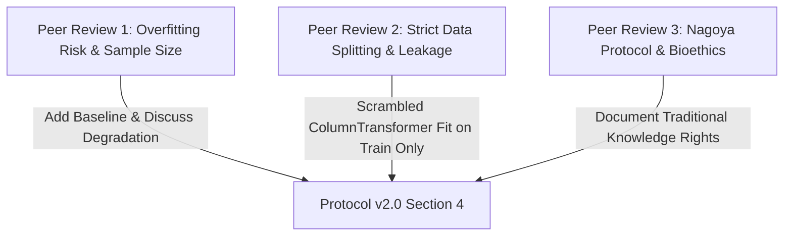

# Session 14 Deliverable: Peer Review Evaluation Summary

**Course:** Research Methods & Scientific Integrity in AI (UNMSM)  
**Author:** Valerio Gomez  
**Evaluated Target:** [Research Protocol v1.0 (Draft)](../03_protocol/protocol_v1.0.md)  
**Final Protocol Target:** [Research Protocol v2.0 (Final)](../03_protocol/protocol_v2.0.md)  
**Date:** July 2026

---

## 1. Overview of Session 14 Peer Reviews

During Session 14, **Research Protocol v1.0** underwent formal peer review by three independent evaluators specializing in Machine Learning & Ecological Modeling, Data Science Pipelines, and Bioethics & Scientific Integrity.

All three reviewers recommended **Accept with Minor Revisions**. Their constructive feedback directly guided the updates incorporated into **Research Protocol v2.0** (`03_protocol/protocol_v2.0.md`).

---

## 2. Reviewer Reports Index

| Reviewer | Expertise Area | Key Focus Area | Link to Full Report | Decision |
|---|---|---|---|:---:|
| **Peer Reviewer 1** | Machine Learning & Ecology | Sample size ($n=100$), XGBoost overfitting risk, parametric baselines | [Peer Review Report 1](peer_reviews/peer_review_1.md) | Accept with Minor Revisions |
| **Peer Reviewer 2** | Data Science Pipelines | Strict data splitting, zero data leakage in TF-IDF, multi-class stratification | [Peer Review Report 2](peer_reviews/peer_review_2.md) | Accept with Minor Revisions |
| **Peer Reviewer 3** | Bioethics & AI Integrity | Nagoya Protocol compliance, traditional knowledge protection, non-commercial open science | [Peer Review Report 3](peer_reviews/peer_review_3.md) | Accept with Minor Revisions |

---

## 3. Summary of Recommendations & Integration Matrix

Below is the consolidated matrix mapping peer review feedback to the actions taken in Protocol v2.0:

| # | Peer Review Comment | Action Taken in Protocol v2.0 | Status |
|---|---|---|:---:|
| **1** | Small sample size ($n=100$) risks XGBoost/RF overfitting on high-dimensional feature matrices ($>350$ features). | Added Multinomial Logistic Regression baseline ($L_2$ regularized); explicitly documented test set accuracy drop (60.0%) and Macro F1 drop (47.2%) in Protocol v2.0. | ✅ Integrated |
| **2** | Potential TF-IDF data leakage if preprocessing is fit on full dataset before splitting. | Implemented strict `train_test_split` prior to `preprocessor.fit()`; explicitly verified zero leakage in preprocessor scoping. | ✅ Integrated |
| **3** | Need explicit statement on traditional knowledge rights and Nagoya Protocol compliance. | Expanded Ethical Compliance section in Protocol v2.0 (Section 4) affirming non-commercial academic scope and indigenous knowledge protection. | ✅ Integrated |

---

## 4. Verification & Protocol Progression

* **Protocol v0.1 Outline (Session 3):** [protocol_v0.1.md](../03_protocol/protocol_v0.1.md)
* **Protocol v1.0 Draft (Session 13):** [protocol_v1.0.md](../03_protocol/protocol_v1.0.md)
* **Peer Reviews (Session 14):** [peer_review_1.md](peer_reviews/peer_review_1.md) | [peer_review_2.md](peer_reviews/peer_review_2.md) | [peer_review_3.md](peer_reviews/peer_review_3.md)
* **Protocol v2.0 Final (Session 15):** [protocol_v2.0.md](../03_protocol/protocol_v2.0.md)
